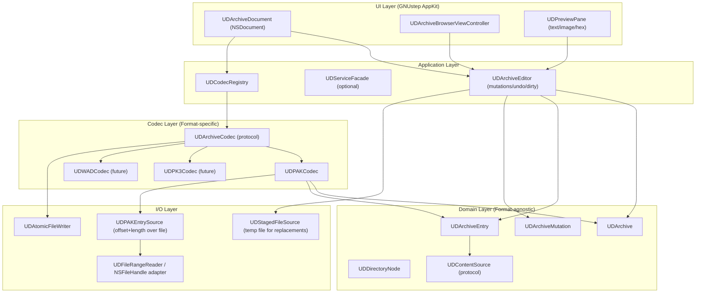
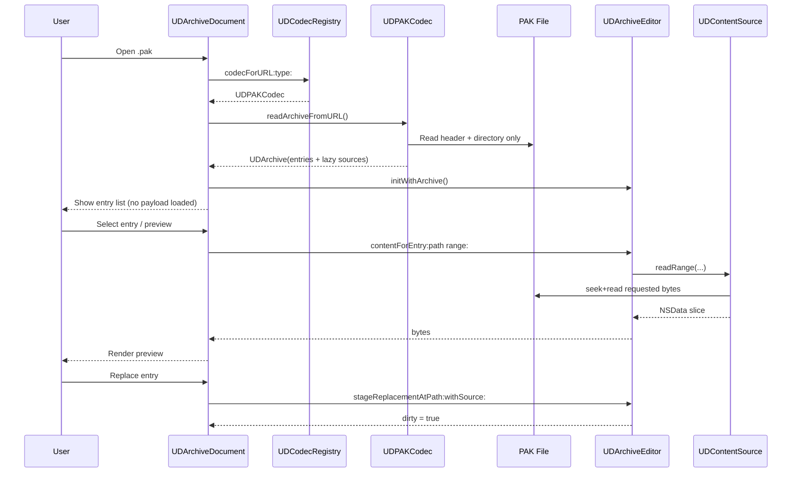
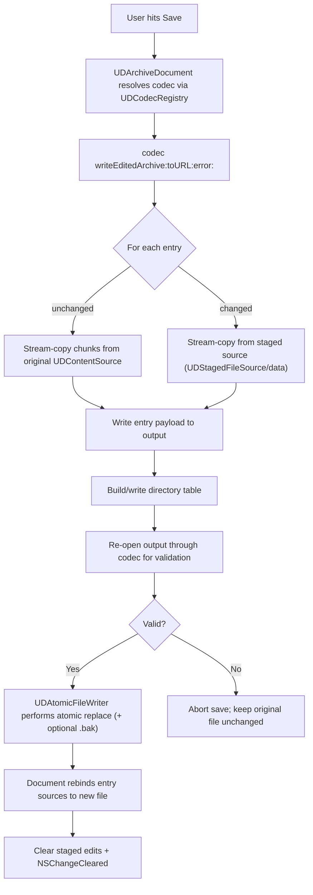
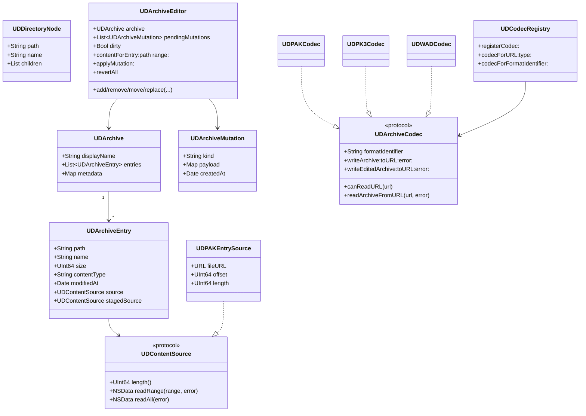
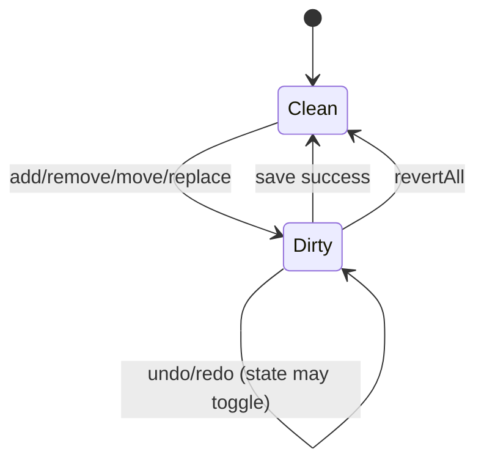
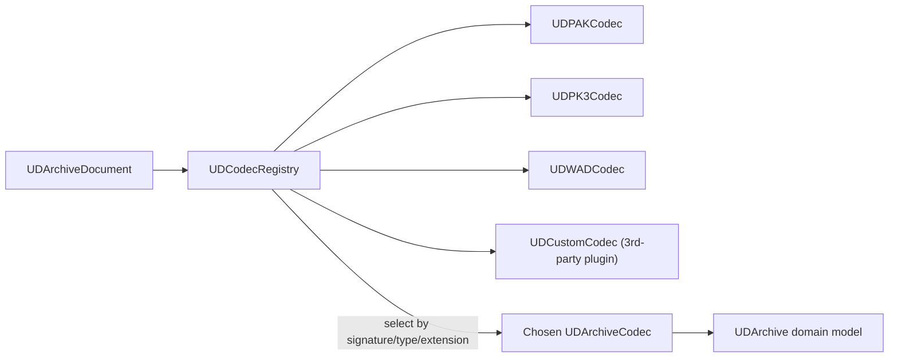
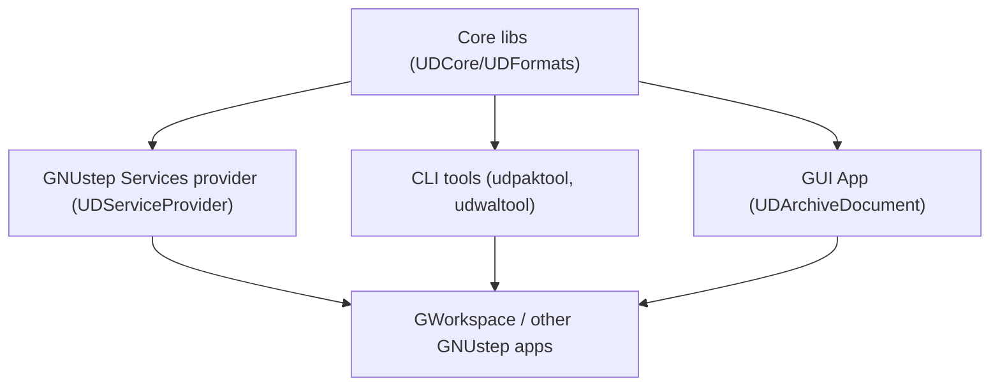
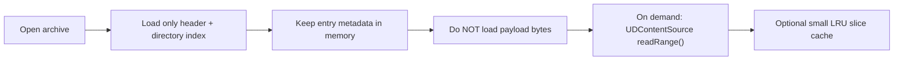
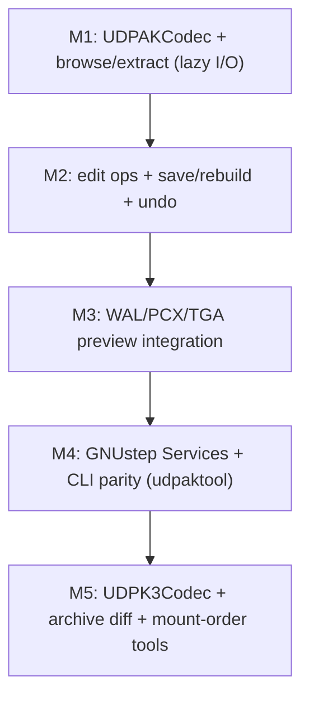

# GNUstep idTech Archive Toolkit — High-Level Design

## 1) Layered Architecture

---

## 2) NSDocument Lifecycle (Lazy I/O)

---

## 3) Save/Rebuild Flow (Streaming, No Full Materialization)

---

## 4) Domain Model (Format-Agnostic)

---

## 5) Mutation/Undo Model

---

## 6) Format Extensibility (Plugins/Adapters)

---

## 7) Integration Surface (GNUstep Ecosystem)

---

## 8) Memory Strategy (At a Glance)

---

## 9) Suggested Milestones

