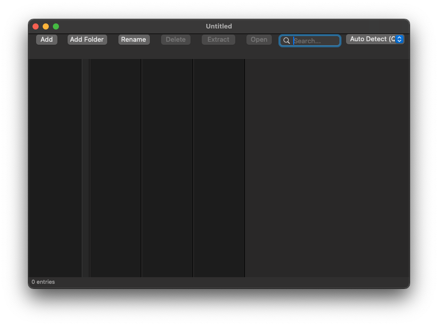
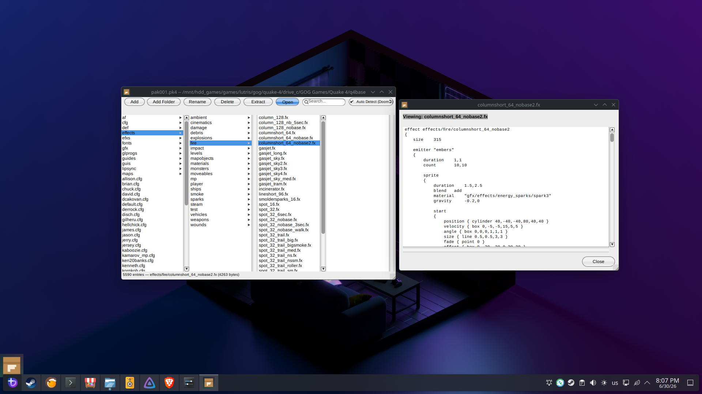

# UDQuakeTools

UDQuakeTools is a GNUstep/macOS toolkit for browsing and editing idTech archive formats.
The main GUI app is Pak Manager, and the repository also includes a small command-line utility and tests.

## Pak Manager

This app helps you manage pak/pk3/pk4 files.




## Project Layout

- `Sources/PakManager`: GUI app (GNUstep + Cocoa/AppKit)
- `Sources/UDCore`: Format-agnostic archive domain model and editor logic
- `Sources/UDFormats`: Archive codecs (PAK, PK3, PK4, etc.)
- `Sources/Tools/udpaktool`: CLI utility target
- `Tests`: Unit tests
- `Scripts`: Build and packaging scripts (GNUstep stack, AppDir, AppImage)

## Prerequisites

### macOS (Xcode build)

- Xcode with command line tools

### GNUstep/Linux build

- clang / clang++
- cmake
- make
- git
- python3
- GNUstep dependencies required by your distro

## Build

### macOS (Xcode)

Open `PakManager.xcodeproj` and build the `Pak Manager` scheme.

### GNUstep stack and app

From the repository root:

```bash
./Scripts/build-gnustep.sh
./Scripts/prepare-appdir.sh
```

## AppImage Packaging

From the repository root:

```bash
./Scripts/package-appimage.sh
```

AppImage assets are tracked in `Scripts/appimage`.
The app icon is tracked in `Sources/PakManager/PakManager.png` and copied into AppImage metadata during packaging.

## Tests

Run tests using your active build system/scheme:

- Xcode: run the `UDQuakeToolsTests` target
- GNUstep: use the test makefile in `Tests/GNUmakefile`

## Notes

- Architecture notes: `ARCHITECTURE.md`
- Early interface stubs: `CLASS_STUBS.md`
- License: `LICENSE`
