# UDQuakeTools

The tools to make a Doom 3 mod, for **macOS, Linux and Windows**, as an
extension of [UDCode](https://github.com/ashalkhakov/UDCodeKit). Quarry opens a game
install or a mod, finds every declaration in it, loose or inside its paks,
and edits them in editors of their own: materials lit as the game lights
them, particles and FX playing as the game plays them, GUIs that run and
can be laid out on a canvas. Scripts are written with completion and debugged
in a running game. What you change is saved into your mod, and the game's own
files are left as they are.

The editors are the ones id shipped with Doom 3 (the Windows-only MFC tools in
`neo/tools`), rebuilt in Objective-C and AppKit. Where the engine's code
decides how something looks or behaves, that code is ported, so a material,
particle or GUI looks and runs in the editor as it does in the game.

| | macOS | Linux (GNUstep) | Windows |
|---|:---:|:---:|:---:|
| The main menu in the GUI editor's design | 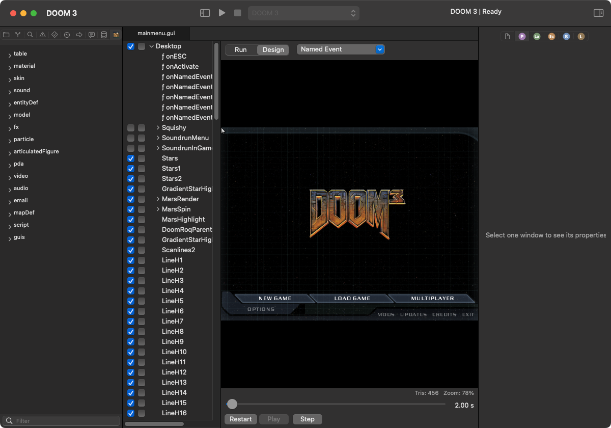 | 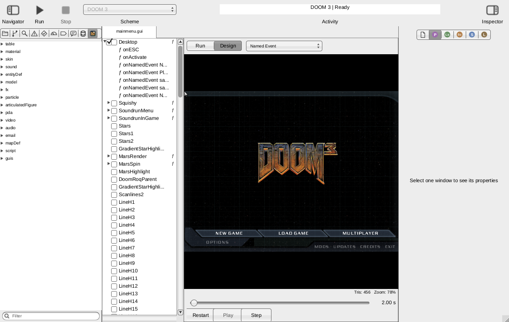 | 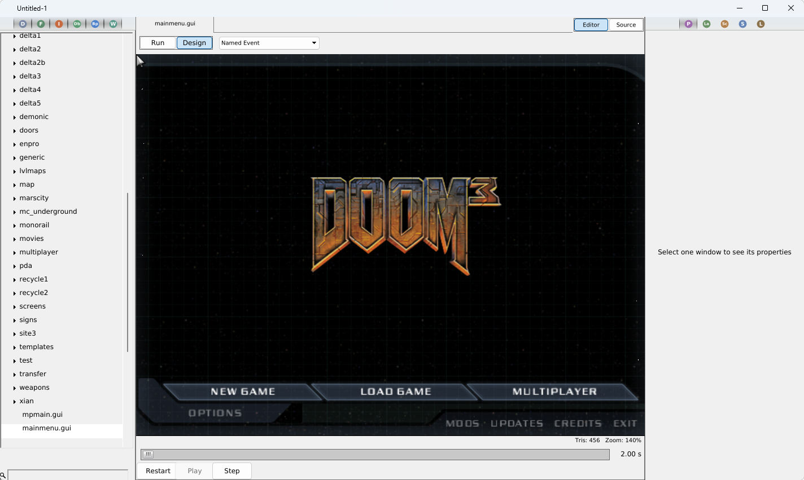 |
| A material, lit as the game lights it | 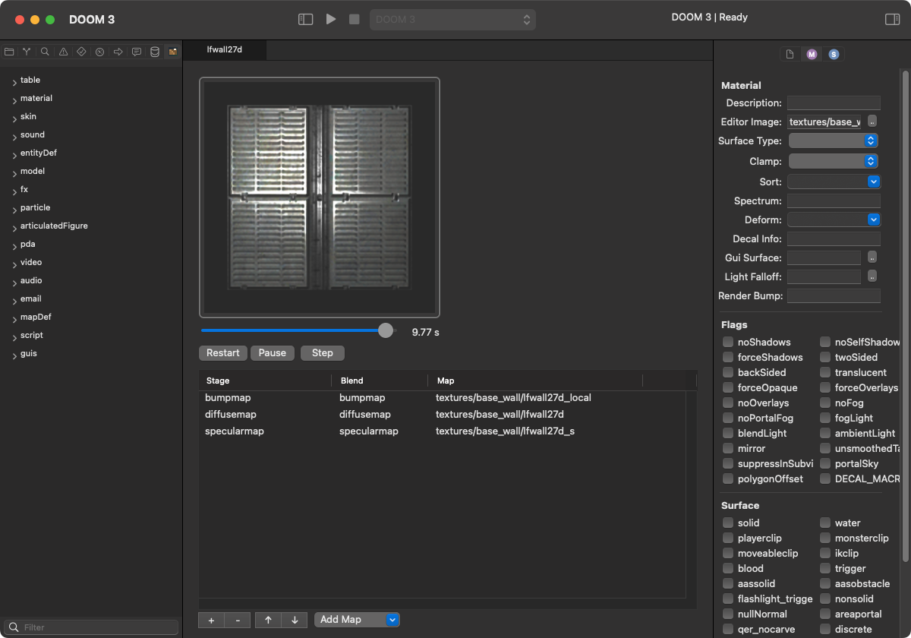 | 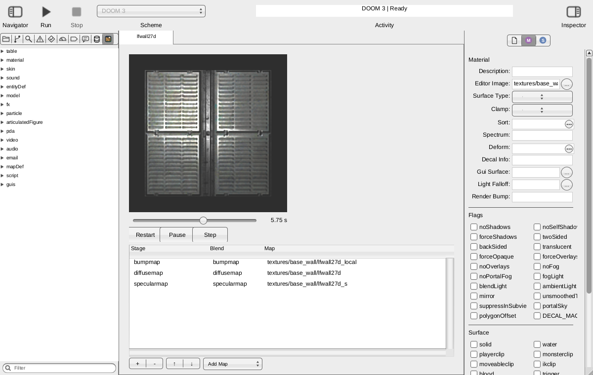 | 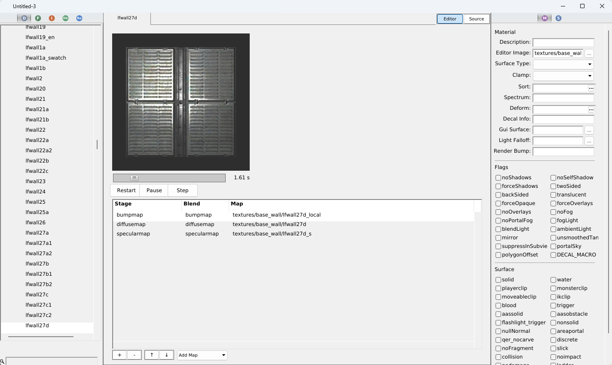 |
| A particle system playing | 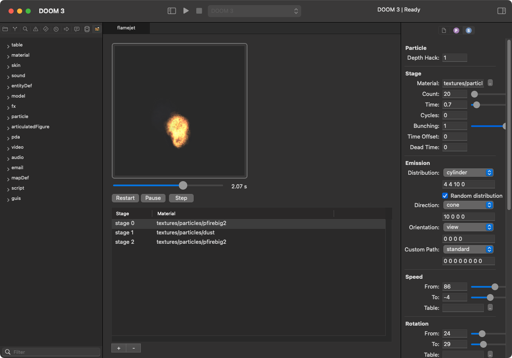 | 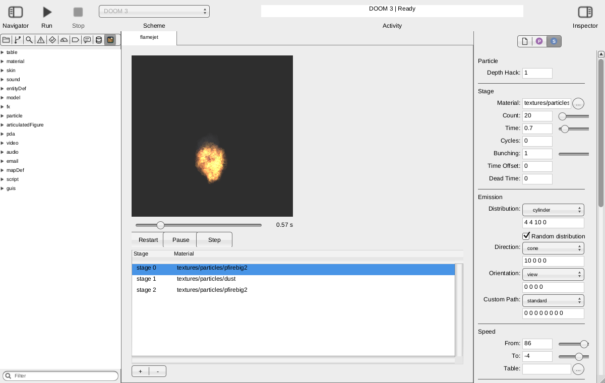 | 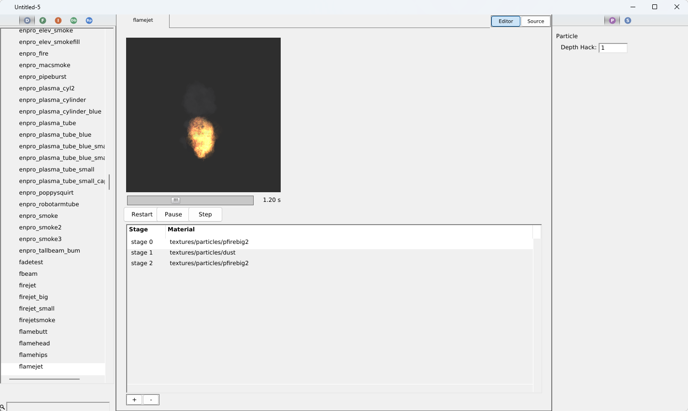 |

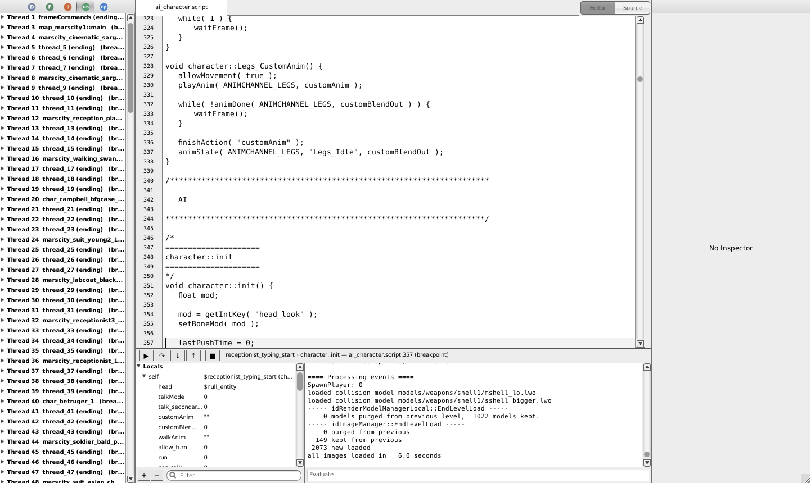
*The script debugger, stopped at a breakpoint as Mars City starts, `self` opened (Linux).*

## Get it

Download from [Releases](https://github.com/ashalkhakov/UDQuakeTools/releases/latest)
either UDCode with the tools in it, or the extension alone for the UDCode
you have:

| Platform | UDCode with the tools | The extension alone |
|---|---|---|
| macOS | `UDCode-UDQuakeTools-macOS-*.zip` | `udquaketools-*-darwin-arm64.udcx`, `…-darwin-x64.udcx` |
| Linux x86_64 | `UDCode-UDQuakeTools-*-x86_64.AppImage` | `udquaketools-*-linux-x64.udcx` |
| Windows x64 | `UDCode-UDQuakeTools-*-win64-portable.zip` | `udquaketools-*-win32-x64.udcx` |

UDCode with the tools is UDCode as its own release has it, the extension
installed the first time it starts. The extension alone goes into UDCode
(0.22 or later) with **UDCode > Extensions… > Install from Package…**, and
loads the next time UDCode starts. Either
way the extension then updates itself from this repository's releases, and
UDCode from its own.

Open a folder with a `.qworkspace` in it (or make one: **Editor > New Quarry
Workspace…** on a folder) and the window is a Quarry workspace: the Decls
navigator on the left, the decls and GUIs in editors of their own, the
scripts in UDCode's editor with their language server. A pak (`.pk4`,
`.pak`, `.pk3`) opens in Pak Manager's browser in a tab of its own.

The AppImage is built on Ubuntu 22.04, so it needs glibc 2.35 or later and a
desktop's usual libraries (fontconfig, X11, OpenGL). Where there's no FUSE,
`./UDCode-UDQuakeTools-*.AppImage --appimage-extract-and-run` runs it anyway.
The Windows zip isn't signed yet: if SmartScreen says it protected your PC,
choose **More info**, then **Run anyway**.

Every push also uploads builds to its [Actions run](https://github.com/ashalkhakov/UDQuakeTools/actions).
To build from source, see [Building](docs/building.md); how the extension
sits in UDCode, [UDCode](docs/UDCODE.md).

## What's in it

| | What it's for |
|---|---|
| **Quarry** | Browse, search and edit a game's or mod's declarations, GUIs and scripts, and debug the scripts |
| **Pak Manager** | Open, extract and make archives: Quake's PAK, Daikatana's PAK, PAK2, PK3 and PK4, each in a tab of its own |
| `udpaktool` | Lists and extracts archives from the command line |
| `udscript-lsp`, `udscript-dap` | idScript's language server and debug adapter, which the extension starts for itself |

| Pak Manager on macOS | Pak Manager on Linux (GNUstep) | Pak Manager on Windows |
|---|---|---|
| 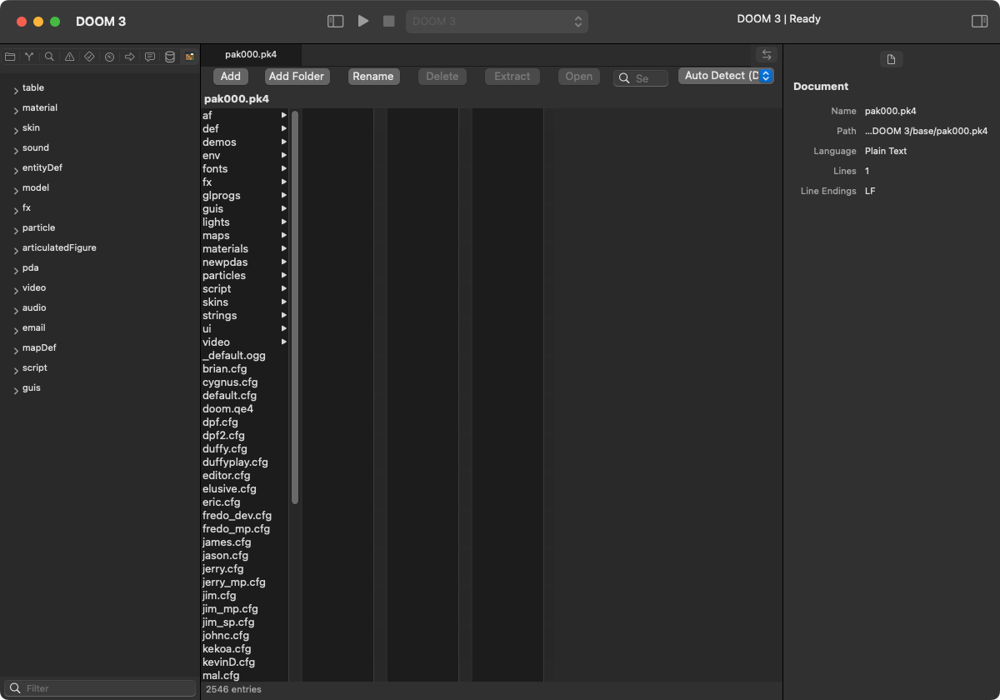 | 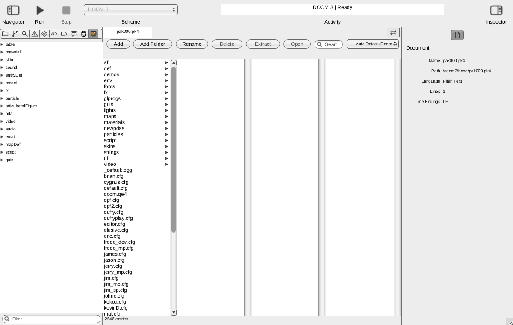 | 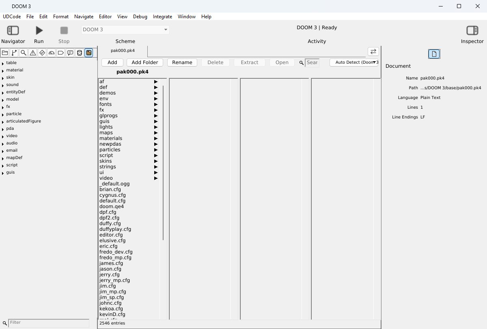 |

## What Quarry does

- **A workspace over a game.** Open Doom 3, Resurrection of Evil or a mod
  folder. Quarry reads the game's paks as the engine does, a later pak
  overriding an earlier one, and lists every declaration, GUI and script
  in one outline you can filter and search. An edit is saved to your mod's
  folder (`fs_savepath`), never into the paks.
- **An editor for each declaration type**, each with its own Issues tab
  listing what the game wouldn't find or would refuse:
  - **Materials:** keywords and stages, with a preview of the material on a
    square lit as the game's ARB2 interaction pass lights it.
  - **Particles and FX:** every stage parameter, with the system playing in
    a preview as the engine plays it.
  - **Articulated figures:** bodies and constraints, the joints taken from the
    model.
  - **entityDefs and mapDefs:** what they inherit and override.
  - **PDAs** with their emails, audio logs and videos, plus sound shaders,
    skins and tables.

  Anything else opens as highlighted text with Test Declaration. A
  declaration is written back the way the engine wrote it, untouched text
  byte for byte.
- **A GUI editor.** The `.gui` runs on the game's clock, its scripts and
  events working and the mouse and keys going to it, so the main menu or a
  PDA is fully interactive. In Design mode, windows are selected, moved and
  sized on a canvas with handles and a grid. A timeline takes the GUI to
  any moment, and the windows' properties and scripts are edited in
  inspectors.
- **A script editor and debugger.** `.script` files get highlighting, parse
  errors as you type, completion of events and functions with their
  arguments, help on hover, and Jump to Definition across the mod. Run starts
  the game with your breakpoints set, and when it stops you get:
  - the threads and their call stacks;
  - the variables, with `self` opening to its fields;
  - expressions in watches, hovers and the console;
  - conditional breakpoints and logpoints;
  - step over, into and out, and Run to Cursor.

  See [Debugging scripts](docs/debugging.md).
- **Pickers and an expression editor.** Wherever a name is typed (a
  material, image, table, sound, model, skin, entityDef or font) a picker
  lists what the game has, at once even for a retail install's 13,000
  materials and images. A material's registers and a GUI's conditions open
  in an expression editor, checked as the engine parses them.

## Limitations

- **Doom 3 and its expansion only.** Quake 4 and other idTech 4 games are on
  the roadmap. Pak Manager opens archives from Quake, Quake II, Quake III and
  Daikatana, but Quarry edits only Doom 3's declarations.
- **No 3D previews and no map editing yet.** Models, lights and articulated
  figures in motion need a running engine, through a planned edit bridge.
  Maps are DarkRadiant's job.
- **The full script debugger needs our fork of dhewm3**
  ([ashalkhakov/dhewm3](https://github.com/ashalkhakov/dhewm3)): a dhewm3 for
  mod authoring, kept up to date with dhewm3. Stock dhewm3 1.5.5 can be
  debugged too, but without stopping at script errors, other threads'
  variables, entities' spawn args, setting variables or jumping.
- **On Linux and Windows** UDCode runs on GNUstep, patched by
  [gnustep-patches](https://github.com/ashalkhakov/gnustep-patches) until the
  fixes are upstream; UDCode's AppImage and Windows packages carry it.

The plan, editor by editor: [ROADMAP.md](ROADMAP.md).

## Layout

| Path | What |
|---|---|
| `Sources/Libraries/` | The libraries, bottom up: `UDIdLib` (idLib, ported), `UDCommon` (the engine's file system and decl manager, ported), `UDArchives`, `UDImages`, `UDDecls`, `UDRenderer`, `UDUI` (the GUI code, ported), `UDGUIEditor`, `UDScripts`, `UDWorkspace` |
| `Sources/Quarry/` | The extension, `UDQuakeTools.bundle`: `Extension` (what UDCode calls: the project, the custom documents, the editors' host, the Editor menu, running and debugging), and Quarry's parts in folders: `Model`, `Documents`, `Window`, `Editors`, `Preview`, `GUIEditor`, `Scripts` |
| `Sources/PakManager/` | Pak Manager's archive browser, the extension's editor of a pak |
| `Sources/LSPServerKit/`, `Sources/Tools/` | The language-server framework; `udpaktool`, `udscript-lsp`, `udscript-dap` |
| `UDCodeExtension/` | The extension's manifest (`package.json`), its modes and highlights |
| `tree-sitter-iddecl/`, `tree-sitter-idscript/` | The grammars the extension's modes highlight with |
| `Tests/` | Each library's unit tests; `Tests/Extension` the extension's; `Tests/Quarry` drives the editors through the extension, in a window standing in for UDCode's |
| `docs/` | Building, UDCode, debugging scripts |
| `.github/release/udcode.conf` | How the extension is packaged, and UDCode with it |

The text editor, the tabs, the debugger views and the window are
[UDCode](https://github.com/ashalkhakov/UDCodeKit)'s.

## Documentation

- [Building](docs/building.md): Xcode, make on GNUstep (Linux, and Windows in
  MSYS2), the tests, the packages
- [UDCode](docs/UDCODE.md): what the extension gives UDCode, and how
- [Debugging scripts](docs/debugging.md): setting up a game to debug, what
  works with stock dhewm3 and with our fork
- [Roadmap](ROADMAP.md): every editor, done and to do

## License

GPL 3.0 or later (`LICENSE`). The code ported from Doom 3 (idLib, the file
system, the decl manager, the GUI code, the parsers and the renderer's
passes) comes from the Doom 3 GPL source, which is GPLv3 with id Software's
additional terms; see those files' headers.
